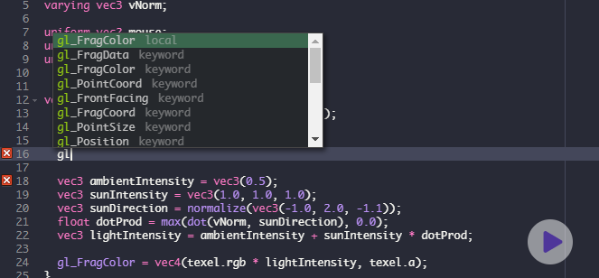
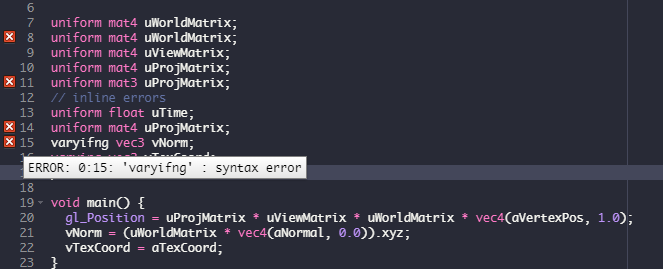
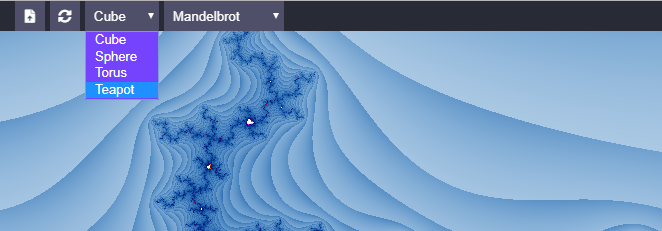
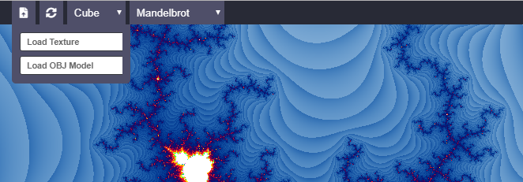
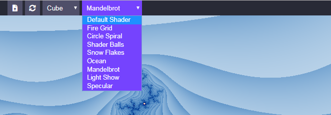

# Shader Expo
:sunrise: :rainbow:

WebGL Shader Playground.

`ShaderExpo` is purely dependency free shader editor made in Raw WebGL API.
Experiment with basic webgl shaders on the fly.

## :file_folder: Features
- Rich CodeEditor
- Simple CodeEditor
- AutoCompletion
- Live Editing
- Basic Debugging

## Auto Completion

## Inline Errors

## Basic Meshes

## Texture and Custom OBJ Model Loading

## Example Shaders

-----------------

## :necktie: Avialable Uniforms

| **Name**      | **Type**   |    Description    |
| ------------- | ---------- | ----------------- |
| uWorldMatrix  | mat4       | I don't know |
| uViewMatrix   | mat4       | I don't know |
| uProjMatrix   | mat4       | I don't know |
| uTime         | float      | current frame time        |
| mouse         | vec2       | mouse postion |
| resolution    | vec2       | canvas width, height|
| viewPos       | vec3       | camera position|
| texture       | sampler2D  | default diffuse texture|

### :game_die: Third Party Libs
- Ace

### :memo: TODO
- [x] Add 3D Models
- [x] More Shader Variables
- [ ] Saving Shaders
- [ ] OOP
 

-----------------

Contributions are welcome.

Example Shaders are taken from https://glslsandbox.com

:star: Support the project by giving it a star :star:

## :octocat: Author
- hazru.anurag@gmail.com
- https://anuraghazra.github.io

Made with :heart: and JavaScript